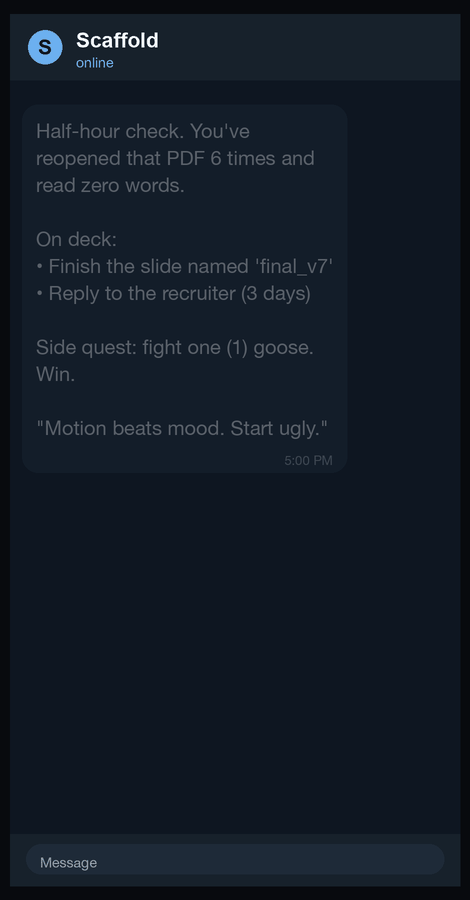

# Scaffold

**External executive function for a brain that won't provide its own.**

I have ADHD. My whole life looks like this: I get an idea, I go all in for a day, and then
I quietly abandon it and feel like garbage about it later. Not because I don't care. Because
the part of my brain that's supposed to say "hey, it's 2pm, go do the thing" just doesn't
fire. Willpower was never the missing piece. Structure was.

So I built the structure and put it outside my head, where it can't be forgotten.

Scaffold is two things wired together:

1. A **second brain** in Obsidian (plain markdown notes, PARA layout) that holds my plans,
   my projects, and the thoughts I dump when I can't hold them.
2. A **Telegram bot** that texts me every 30 minutes, all day, telling me what to do,
   nudging me when I drift, and dropping a mindfulness line so I don't spiral.

It runs on my Mac. It does not need me to keep anything open. It does not care whether I
feel motivated. It just keeps showing up, which is the one thing I could never do for myself.

---

## What it actually feels like

<p align="center">
  
</p>

Every half hour my phone buzzes with something like this:

```
⚡ Half-hour check. What are you doing right now? If it isn't a must-do, switch.

On deck:
  • Run CleanCast end to end and write down whatever breaks
  • Pick 3 startups for outreach and paste the names into your notes

🎲 Side quest: Take a different route home today. A new route unlocks new thoughts.

💭 Discipline is not a feeling you wait for. It is the bridge you build by walking across it.
   — ✎
```

The tone is **firm during work hours and gentle around breaks**. The tasks are pulled from
my actual notes, not a generic list. And the mindfulness line at the bottom is chosen to
interrupt whatever loop I tend to fall into.

And I can text it back. In plain English.

- "what should I work on right now" → it reads my plan and tells me.
- "nudge me every hour instead" → it changes its own schedule.
- "I already did that, give me something else" → it remembers and moves on.
- "anxious" → it aims the calm nudges at anxiety for the next few hours.
- "quiet" → it shuts up for a bit. "go" → it comes back.

Anything it doesn't recognize as a command gets handed to Claude Code, which can read and
edit my plan and its own schedule and then text me back. It has a short memory, so it stops
contradicting itself.

---

## How it's built

Three small Python scripts, no framework, no server. State lives in `~/.scaffold`.

| Piece | What it does | Runs via |
|---|---|---|
| `nudge.py` | Every :00 and :30, composes and sends the check-up | cron, every 10 min |
| `curate.py` | A few times a day, asks Claude to read my notes and distill a realistic task pool | LaunchAgent |
| `listen.py` | Every minute, checks Telegram for my messages and reacts (commands, mood bias, or the Claude bridge) | LaunchAgent |
| `scan_detect.py` | Notices which notes I've changed and settled | cron, every 3 min |
| `scan_extract.py` | Reads those notes with Claude and pulls out hidden tasks | LaunchAgent |

The split is deliberate: the *smart* part (reading my whole vault and picking good tasks) is
expensive, so it runs a few times a day and writes a small `tasks.json`. The *frequent* part
(the nudge itself) just reads that file and is basically free.

The mindfulness library (`mindful.json`) is 40 lines, half from named voices in the
contemplative tradition (Marcus Aurelius, Seneca, Thich Nhat Hanh, Pema Chödrön, and others)
and half written by me, each tagged with the mental loop it's meant to interrupt.

### Nothing I write down gets lost

The part I'm proudest of: I dump thoughts into notes all day and then forget they contained
anything I meant to do. So Scaffold watches my whole vault. When I change a note and stop
editing it, the detector queues it, and Claude reads it and pulls out any task it implies,
even the ones I didn't write as tasks. "been meaning to renew the domain" becomes a task.
"AI is moving so fast" does not. Those candidates quietly join the curator's pool and may
show up in a future nudge. I never have to file them. I just have to have thought them once.

The detection is split on purpose: `scan_detect.py` runs on cron (which can read an iCloud
vault) and only does cheap file-change checks; `scan_extract.py` runs on a LaunchAgent (which
can reach Claude) and only runs when there's actually something new. It debounces, so it never
scans a note you're mid-sentence in, and it costs almost nothing when you're not writing.

---

## Setup

**You need:** a Mac, Python 3, [Claude Code](https://claude.com/claude-code) installed and
logged in, an Obsidian vault (or any folder of markdown), and a Telegram account.

### 1. Clone and install

```bash
git clone https://github.com/abhaymettu/scaffold.git
cd scaffold
./install.sh
```

That copies the engine to `~/.scaffold`, installs the cron nudge job, and loads the two
LaunchAgents.

### 2. Make a Telegram bot

1. In Telegram, message **@BotFather**, send `/newbot`, follow the prompts. It gives you a
   **token** like `8123456789:AAH...`.
2. Message your new bot anything (say "hi"). A bot can't text you until you text it first.
3. Open `https://api.telegram.org/bot<YOUR_TOKEN>/getUpdates` in a browser and find
   `"chat":{"id":123456789`. That number is your **chat id**.

### 3. Fill in your config

Edit `~/.scaffold/config.json`:

```json
{
  "telegram_bot_token": "8123456789:AAH...",
  "telegram_chat_id": "123456789",
  "vault_path": "/Users/you/path/to/your/Obsidian/Vault",
  "fallback_macos_notification": true
}
```

This file is chmod `600` and is **never** committed. Your token is a password. Keep it out
of any synced folder.

### 4. Point it at your vault (optional but recommended)

Drop the contents of `vault-template/` into a new Obsidian vault to get the folder layout
and the `CLAUDE.md` that tells the curator where your tasks live. Put your daily plan at
`Daily Plans/YYYY-MM-DD.md` with a `## Must-Do` section, and Scaffold will read it.

### 5. macOS permission (if your vault is in iCloud)

cron is sandboxed and can't read iCloud by default. Grant it access:
System Settings → Privacy & Security → **Full Disk Access** → **+** → press
**Cmd+Shift+G** → type `/usr/sbin/cron` → Add → toggle on.

### 6. Confirm it's alive

Text your bot `themes`. If it answers, you're done. Otherwise wait for the next :00 or :30.

---

## Turning it off

```bash
crontab -l | grep -v scaffold/nudge.py | crontab -
launchctl bootout gui/$(id -u)/com.scaffold.listen
launchctl bootout gui/$(id -u)/com.scaffold.curate
```

---

## A few honest limitations

- **It only works while your Mac is awake.** Lid closed on battery means it sleeps and goes
  quiet. Your texts aren't lost (Telegram holds them), it just answers when the Mac wakes.
  If you want true 24/7, run it on an always-on box.
- **The Claude bridge costs whatever your Claude usage costs.** The frequent nudges are free;
  only the freeform texts and the few daily curation runs call Claude.
- **It's Mac-first.** The scripts are portable, but the scheduling (cron + launchd) and the
  notification fallback assume macOS. Linux users can swap in systemd timers.

---

## Why "Scaffold"

Scaffolding is the temporary structure you build around something that can't yet hold itself
up. That's what this is. Some days the task holds itself up and I don't need the buzz. Most
days I do. Either way it's there, and it doesn't depend on me being the kind of person who
remembers. I'm not. That was the whole problem.

MIT licensed. Take it, fork it, make it yours.
